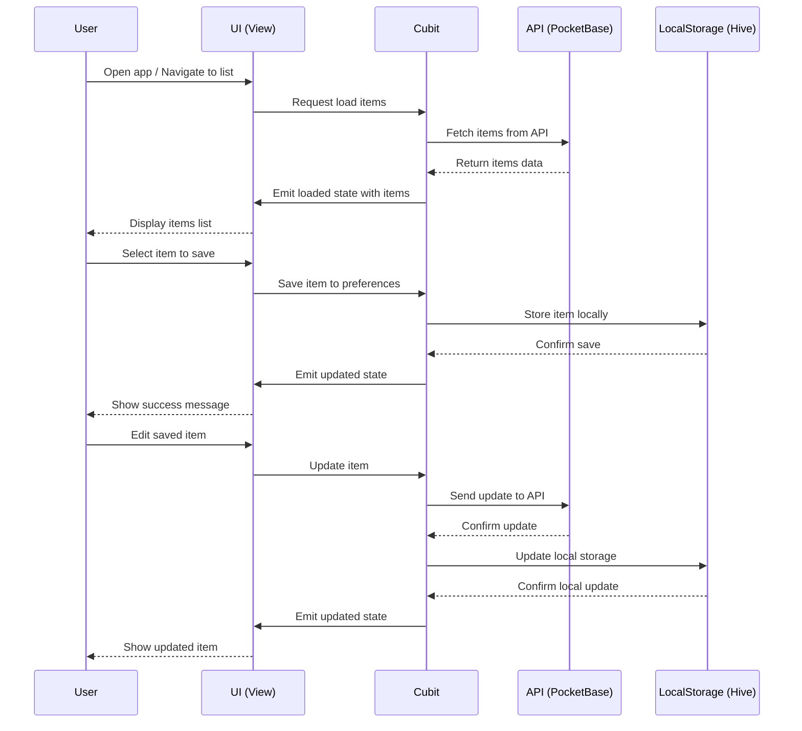
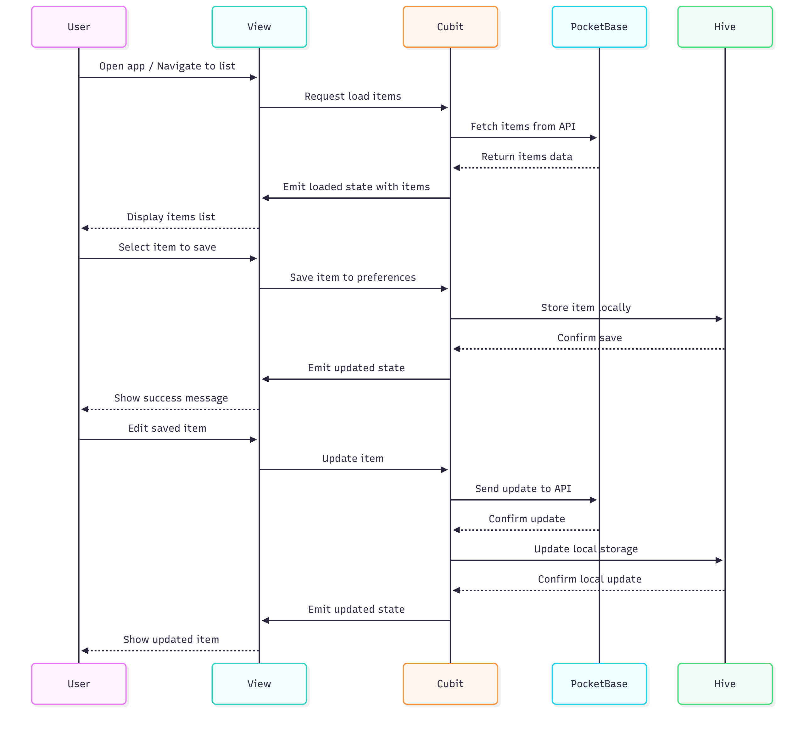

# ListItems Flutter App

A Flutter application for managing a list of items from an API and saving favorites locally.

## Description

This app allows users to:
- Fetch and display items from a public API
- Search through the items
- Save items with custom names to local storage
- View, edit, and delete saved items

## Sequence Diagram

lib/
│
├── main.dart                          # Punto de entrada de la app
│
├── config/
│   ├── configuration.dart             # Configuración de API (PocketBase)
│   └── schema_configuration.dart      # Esquemas de configuración
│
├── core/
│   ├── constant/
│   │   ├── controller_state.dart      # Estados de controladores
│   │   └── nameslabel.dart            # Etiquetas y constantes de UI
│   └── router/
│       └── go_router.dart             # Configuración de navegación (GoRouter)
│
├── list/                              # Módulo/Feature: Gestión de lista de ítems
│   ├── cubit/
│   │   ├── apitcubit.dart             # Lógica de negocio para API de ítems
│   │   ├── api_state.dart             # Estados del cubit de API
│   │   ├── preference_cubit.dart      # Lógica para preferencias locales
│   │   └── preference_state.dart      # Estados del cubit de preferencias
│   ├── model/
│   │   ├── item.dart                  # Modelo de ítem (de API)
│   │   └── saved_item.dart            # Modelo de ítem guardado (Hive)
│   ├── utils/
│   │   └── date_formated.dart         # Utilidad para formatear fechas
│   └── view/
│       ├── ApiDetailPage.dart         # Página de detalle de ítem
│       ├── ApiEditPage.dart           # Página de edición de ítem
│       ├── ApiListPage.dart           # Página de lista de ítems
│       └── PrefsNewPage.dart          # Página de nuevas preferencias/ítems
│
├── login/                             # Módulo/Feature: Autenticación (si implementado)
│   ├── cubit/
│   ├── model/
│   ├── utils/
│   └── view/
│
└── widget/                            # Widgets compartidos/reutilizables
    ├── dialog_widget.dart             # Diálogo de confirmación personalizado
    └── item_widget.dart               # Widget para mostrar ítems en lista

## Features

- **API Integration**: Fetches items from a REST API
- **Local Storage**: Uses Hive for persistent storage
- **State Management**: Implements BLoC pattern with Cubit
- **Search Functionality**: Real-time search in API items
- **CRUD Operations**: Create, Read, Update, Delete for saved items
- **Responsive UI**: Adaptive design for different screen sizes

## Architecture

- **Presentation Layer**: Views (Pages) using Flutter widgets
- **Business Logic Layer**: Cubits for state management
- **Data Layer**: Models and local storage with Hive
- **Network Layer**: HTTP client for API calls

## Technologies Used

- Flutter
- Dart
- BLoC/Cubit
- Hive
- HTTP
- Go Router

## Installation

1. Clone the repository
2. Run `flutter pub get` to install dependencies
3. Run `flutter pub run build_runner build` to generate Hive adapters
4. Run `flutter run` to start the app

## Usage

- Navigate to `/api-list` to view and search API items
- Tap on an item to save it with a custom name
- Go to `/prefs` to view saved items
- Use `/prefs/new` to create a new saved item
- Tap on a saved item to view details and edit

## API

The app uses a custom API endpoint. Update the URL in `ApiCubit` if needed.

## Local Storage

Data is stored locally using Hive. The database is initialized on app start.

## Contributing

1. Follow the existing code style
2. Write tests for new features
3. Update documentation as needed

## License

This project is for educational purposes.
